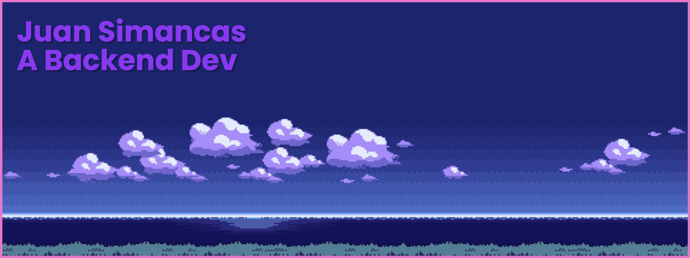

This is my dump site for coding!
- 🔭 I'm currently working on my website!
- 🌱 I'm currently learning SvelteJS
- 📫 My main languages are JavaScript and Rust

| Group | Name |
| :---: | :---: |
| Languages |     |
| Tools |       | 
| Frameworks |    |

